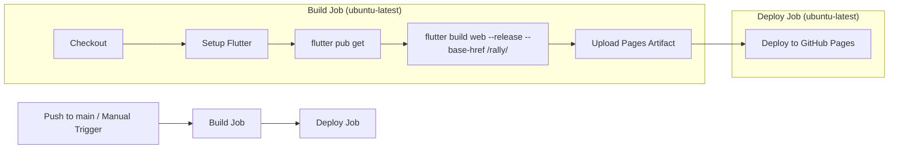

# Design Document: GitHub Pages Deployment

## Overview

This design covers the automated deployment pipeline for the Rally Flutter web application to GitHub Pages. The solution uses a single GitHub Actions workflow file (`.github/workflows/deploy.yml`) that builds the Flutter web app and deploys the compiled static assets to GitHub Pages.

The workflow is triggered by pushes to the `main` branch or manual dispatch from the GitHub Actions UI. It uses GitHub's first-party Pages actions (`upload-pages-artifact` and `deploy-pages`) for a streamlined deployment without requiring a dedicated deployment branch.

### Key Design Decisions

1. **Single-file workflow** — All build and deploy logic lives in one YAML file for simplicity. The project has no complex multi-environment needs.
2. **GitHub Actions Pages deployment (v4)** — Uses the modern artifact-based Pages deployment instead of the older `gh-pages` branch approach. This avoids polluting git history with build artifacts.
3. **Concurrency control** — A concurrency group ensures only one deployment runs at a time, cancelling in-progress runs when new commits land.
4. **Pinned action versions** — All third-party actions are pinned to major version tags for reproducibility while still receiving patch updates.

## Architecture

The deployment pipeline follows a linear two-job architecture:



### Why Two Jobs

Separating build and deploy into distinct jobs provides:
- Clear separation of concerns in the Actions UI
- The deploy job targets the `github-pages` environment, enabling environment protection rules if desired
- Build failures are isolated and don't attempt deployment

### Alternative Considered: Single Job

A single-job approach was considered but rejected because the `deploy-pages` action is designed to run in its own job with the `github-pages` environment declaration. This is GitHub's recommended pattern.

## Components and Interfaces

### Workflow File: `.github/workflows/deploy.yml`

The workflow consists of the following components:

| Component | Responsibility |
|-----------|---------------|
| Trigger configuration | Defines when the workflow runs (push to main, manual dispatch) |
| Permissions block | Grants minimum required permissions for Pages deployment |
| Concurrency block | Prevents simultaneous deployments |
| Build job | Checks out code, sets up Flutter, builds web output |
| Deploy job | Deploys the uploaded artifact to GitHub Pages |

### External Actions Used

| Action | Version | Purpose |
|--------|---------|---------|
| `actions/checkout` | `v4` | Checks out repository source code |
| `subosito/flutter-action` | `v2` | Installs and configures the Flutter SDK |
| `actions/upload-pages-artifact` | `v4` | Packages `build/web` as a Pages artifact |
| `actions/deploy-pages` | `v4` | Deploys the artifact to the `github-pages` environment |

### Interface with GitHub Pages

- The workflow writes to the `github-pages` environment
- GitHub Pages must be configured in the repository settings to use "GitHub Actions" as the source (not a branch)
- The deployed site is served at `https://chriskramer15.github.io/rally/`

## Data Models

### Workflow YAML Structure

```yaml
name: Deploy to GitHub Pages

on:
  push:
    branches: [main]
  workflow_dispatch:

permissions:
  contents: read
  pages: write
  id-token: write

concurrency:
  group: "pages"
  cancel-in-progress: true

jobs:
  build:
    runs-on: ubuntu-latest
    steps:
      - uses: actions/checkout@v4
      - uses: subosito/flutter-action@v2
        with:
          channel: stable
      - run: flutter pub get
      - run: flutter build web --release --base-href /rally/
      - uses: actions/upload-pages-artifact@v4
        with:
          path: build/web

  deploy:
    needs: build
    runs-on: ubuntu-latest
    environment:
      name: github-pages
      url: ${{ steps.deployment.outputs.page_url }}
    steps:
      - id: deployment
        uses: actions/deploy-pages@v4
```

### Build Output Structure

The `flutter build web --release --base-href /rally/` command produces:

```
build/web/
├── index.html          (contains <base href="/rally/">)
├── main.dart.js        (compiled Dart application)
├── flutter.js          (Flutter engine bootstrap)
├── flutter_service_worker.js
├── manifest.json
├── assets/
│   ├── fonts/
│   ├── packages/
│   └── ...
└── icons/
```

All asset references in `index.html` are resolved relative to the `<base href="/rally/">` tag, ensuring correct loading when served from the repository subdirectory.

## Error Handling

### Build Failures

GitHub Actions natively handles step failure propagation:

- Each `run` step uses `shell: bash` by default, which propagates non-zero exit codes
- If `flutter pub get` fails (missing dependencies, network issues), subsequent steps are skipped automatically
- If `flutter build web` fails (compilation errors, asset issues), the upload step is skipped
- The deploy job has `needs: build`, so it only runs when build succeeds

### Deployment Failures

- If `upload-pages-artifact` fails (artifact too large, permission denied), the deploy job is skipped
- If `deploy-pages` fails (environment not configured, token issues), the workflow run is marked as failed
- All step outputs and error messages are preserved in the GitHub Actions log

### Common Failure Scenarios

| Scenario | Cause | Resolution |
|----------|-------|------------|
| SDK version mismatch | Flutter stable doesn't satisfy `>=3.10.0` | Pin specific Flutter version in workflow |
| Build compilation error | Dart code errors | Fix code and push again |
| Pages not enabled | Repo settings not configured for Actions source | Enable in Settings → Pages |
| Permission denied | Missing `id-token: write` permission | Verify permissions block |
| Concurrent deploy conflict | Multiple pushes in quick succession | Concurrency group handles this automatically |

## Correctness Properties

This feature is a declarative CI/CD configuration (Infrastructure as Code) rather than algorithmic code, so traditional property-based testing with generated inputs does not apply. However, the following correctness properties must hold:

### Property 1: Trigger Completeness

The workflow MUST execute on every push to `main` AND on every manual `workflow_dispatch` invocation — no trigger is silently ignored.

**Validates: Requirements 1.2, 6.1, 6.2**

### Property 2: Build Determinism

Given the same commit SHA, running the workflow twice SHALL produce a `build/web/` directory with identical `index.html` base-href configuration.

**Validates: Requirements 2.4, 2.5**

### Property 3: Base Href Integrity

The deployed `index.html` SHALL always contain exactly `<base href="/rally/">` — never an empty href, a double-slash, or a missing trailing slash.

**Validates: Requirements 5.1, 5.2, 5.3**

### Property 4: Deployment Atomicity

The site served at `https://chriskramer15.github.io/rally/` SHALL always reflect a single complete build — partial deployments (mix of old and new assets) SHALL NOT occur.

**Validates: Requirements 3.1, 3.2, 3.4**

### Property 5: Failure Isolation

A failure in the build job SHALL prevent the deploy job from executing — the deploy job SHALL never run against stale or missing artifacts.

**Validates: Requirements 4.1, 4.2, 4.3**

These properties are validated through the smoke tests and manual verification described in the Testing Strategy below.

## Testing Strategy

### Why Property-Based Testing Does Not Apply

This feature produces a declarative YAML configuration file (Infrastructure as Code). There are no pure functions, data transformations, or algorithmic logic to test with property-based testing. The workflow file is a static configuration whose correctness is validated by:

1. GitHub Actions' own YAML parser and execution engine
2. Successful deployment producing a reachable URL
3. Manual verification of the deployed site

### Validation Approach

**YAML Lint / Schema Validation:**
- Validate the workflow YAML against the GitHub Actions schema using `actionlint` or similar tooling
- This catches syntax errors, invalid action references, and permission misconfigurations before pushing

**Smoke Test (Post-Deployment):**
- After the workflow runs, verify that `https://chriskramer15.github.io/rally/` returns HTTP 200
- Verify that `index.html` contains `<base href="/rally/">`
- Verify that critical assets (main.dart.js, flutter.js) return HTTP 200

**Manual Verification Checklist:**
- [ ] Workflow appears in GitHub Actions UI with correct name
- [ ] Push to `main` triggers the workflow
- [ ] Manual dispatch from Actions UI triggers the workflow
- [ ] Build step completes successfully
- [ ] Deploy step completes successfully
- [ ] Site loads at the expected URL with no 404 errors for assets
- [ ] Concurrency cancellation works (push twice quickly, first run is cancelled)

**Local Validation (Pre-Push):**
- Run `flutter build web --release --base-href /rally/` locally to verify the build succeeds
- Inspect `build/web/index.html` to confirm the base href tag is present
- Optionally serve `build/web/` locally with a path prefix to verify asset loading
