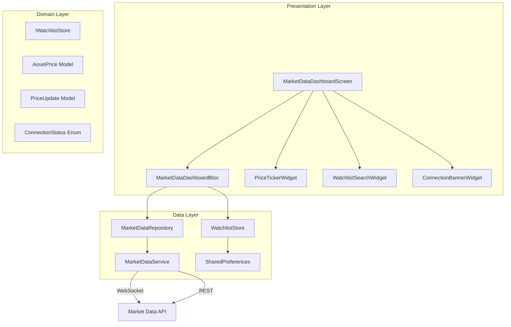

# Design Document: Live Market Data Dashboard

## Overview

This design introduces a dedicated **Market Data Dashboard** screen to the Rally app, providing users with a real-time view of stock and ETF prices for a user-curated watchlist. The feature builds on the existing `MarketDataService`, `MarketDataRepository`, and BLoC architecture, adding:

- A persistent watchlist stored via `SharedPreferences` (max 50 assets)
- WebSocket-based live price streaming with automatic subscription management
- A polling fallback mechanism that activates during connection disruptions
- Visual indicators for price direction, stale data, and connection status
- Robust JSON parsing for `AssetPrice` with structured error reporting
- A public API on the repository for downstream valuation modules

The design prioritizes minimal disruption to the existing layered architecture (data → domain → presentation) while introducing new BLoC events/states and widgets specific to the dashboard.

## Architecture

The feature follows Rally's existing **clean architecture** layering:



**Key design decisions:**

1. **New dedicated BLoC** (`MarketDataDashboardBloc`) — The existing `MarketDataBloc` handles search and single-asset detail. The dashboard requires managing an entire watchlist, multiple subscriptions, and connection state simultaneously. A separate BLoC avoids overloading the existing one and keeps responsibilities clean.

2. **WatchlistStore as a domain-level abstraction** — Persistence is isolated behind an `IWatchlistStore` interface so the BLoC doesn't depend on `SharedPreferences` directly. This makes testing straightforward and allows swapping storage backends later.

3. **Repository polling managed by BLoC** — The `MarketDataDashboardBloc` orchestrates when to start/stop polling based on connection status events, using the existing `startPolling`/`stopPolling` methods on `MarketDataRepository`.

4. **Stale data detection on the widget level** — The `PriceTickerWidget` receives a staleness flag computed by the BLoC (via `MarketDataRepository.isStale`), keeping the widget stateless and testable.

## Components and Interfaces

### WatchlistStore (Data Layer)

```dart
/// Abstract interface for watchlist persistence.
abstract class IWatchlistStore {
  /// Returns the current watchlist symbols.
  List<String> getWatchlist();

  /// Adds a symbol. Returns false if already present or at capacity (50).
  Future<bool> addSymbol(String symbol);

  /// Removes a symbol. Returns false if not present.
  Future<bool> removeSymbol(String symbol);

  /// Returns true if the watchlist contains [symbol].
  bool contains(String symbol);

  /// Returns true if the watchlist has reached capacity (50).
  bool isAtCapacity();
}

/// Concrete implementation backed by SharedPreferences.
class WatchlistStore implements IWatchlistStore {
  static const String _key = 'watchlist_symbols';
  static const int maxCapacity = 50;
  final SharedPreferences _prefs;

  WatchlistStore({required SharedPreferences prefs}) : _prefs = prefs;

  // ...implementation
}
```

### MarketDataDashboardBloc (Presentation Layer)

**Events:**

| Event | Description |
|-------|-------------|
| `DashboardOpened` | Loads watchlist, subscribes to all symbols, starts listening |
| `DashboardClosed` | Unsubscribes all, stops polling |
| `AddToWatchlist(symbol)` | Adds symbol, subscribes to stream |
| `RemoveFromWatchlist(symbol)` | Removes symbol, unsubscribes |
| `PriceUpdated(PriceUpdate)` | Internal: new price received |
| `ConnectionChanged(ConnectionStatus)` | Internal: connection state changed |
| `StaleCheckTriggered` | Internal: periodic timer to re-evaluate staleness |
| `ManualRetryRequested` | User pressed retry after exhausted reconnection |

**States:**

| State | Description |
|-------|-------------|
| `DashboardLoading` | Initial load in progress |
| `DashboardLoaded` | Active state with watchlist prices, connection status |
| `DashboardEmpty` | Watchlist is empty, show prompt |
| `DashboardError(message)` | Unrecoverable error |

The `DashboardLoaded` state holds:
```dart
class DashboardLoaded extends MarketDataDashboardState {
  final Map<String, AssetPrice> prices;
  final Set<String> stalePrices;  // symbols with stale data
  final Set<String> unavailable;  // symbols with no data yet
  final ConnectionStatus connectionStatus;
  final int? reconnectAttempt;    // null when connected
  final DateTime? lastDataReceived;
}
```

### PriceTickerWidget (Presentation Layer)

A stateless widget displaying a single asset's price information:
- Symbol name
- Current price (2 decimal places)
- Percentage change with directional icon and color
- Stale data indicator (when applicable)
- Loading/unavailable placeholder states

### ConnectionBannerWidget (Presentation Layer)

Displays connection status:
- **Disconnected**: Warning banner with "live data unavailable" + last received timestamp
- **Reconnecting**: Shows attempt number (e.g., "Reconnecting... attempt 3/10")
- **Exhausted retries**: Persistent error with manual retry button

### MarketDataRepository Extensions

The existing repository already exposes most needed functionality. Additional public methods:

```dart
/// Returns the cached AssetPrice for [symbol], or null if not cached.
AssetPrice? getCachedPrice(String symbol);

/// Updates the cache with a PriceUpdate event.
void updateCacheFromPriceUpdate(PriceUpdate update);
```

The `getCachedPrice` method is a convenience accessor already supported by `getCachedPrices()[symbol]`, but exposed for clarity. The `updateCacheFromPriceUpdate` method allows the BLoC to feed WebSocket events directly into the cache.

## Data Models

### Existing Models (No Changes Needed)

| Model | Location | Purpose |
|-------|----------|---------|
| `AssetPrice` | `domain/models/asset_price.dart` | Immutable price snapshot with JSON serialization |
| `PriceUpdate` | `domain/models/price_update.dart` | WebSocket price event with JSON parsing |
| `MarketDataException` | `domain/models/market_data_exception.dart` | Structured error for parsing/network failures |
| `ConnectionStatus` | `domain/models/enums.dart` | Enum: connected, disconnected, reconnecting |

### New/Modified Models

**WatchlistChangeResult** (new, domain layer):
```dart
/// Result of a watchlist modification attempt.
sealed class WatchlistChangeResult {
  const WatchlistChangeResult();
}

class WatchlistSymbolAdded extends WatchlistChangeResult {
  final String symbol;
  const WatchlistSymbolAdded(this.symbol);
}

class WatchlistAlreadyExists extends WatchlistChangeResult {
  final String symbol;
  const WatchlistAlreadyExists(this.symbol);
}

class WatchlistAtCapacity extends WatchlistChangeResult {
  const WatchlistAtCapacity();
}

class WatchlistSymbolRemoved extends WatchlistChangeResult {
  final String symbol;
  const WatchlistSymbolRemoved(this.symbol);
}

class WatchlistPersistenceWarning extends WatchlistChangeResult {
  final String message;
  const WatchlistPersistenceWarning(this.message);
}
```

**Staleness logic** (no new model — computed inline):
```dart
// In MarketDataRepository, already exists:
bool isStale(String symbol) {
  final entry = _cache[symbol];
  if (entry == null) return true;
  return DateTime.now().difference(entry.fetchedAt) > staleDuration;
}
```

### JSON Schema (AssetPrice / PriceUpdate)

Both models share the same JSON structure:
```json
{
  "symbol": "AAPL",          // String, required
  "price": 185.42,           // num (int or double), required
  "dailyHigh": 186.10,       // num, required
  "dailyLow": 183.55,        // num, required
  "volume": 52340000,        // num, required
  "percentageChange": 1.23,  // num, required
  "timestamp": "2024-01-15T14:30:00Z"  // ISO 8601 String, required
}
```

Parsing rules (already implemented):
- Missing fields → `MarketDataException` listing all missing field names
- Null or wrong-type fields → `MarketDataException` identifying field + expected type
- Invalid ISO 8601 timestamp → `MarketDataException` with the invalid value
- `num` inputs stored as `double` via `.toDouble()`
- Timestamps normalized to UTC via `.toUtc()`


## Correctness Properties

*A property is a characteristic or behavior that should hold true across all valid executions of a system — essentially, a formal statement about what the system should do. Properties serve as the bridge between human-readable specifications and machine-verifiable correctness guarantees.*

### Property 1: Watchlist add is set-like

*For any* watchlist state and any valid symbol, adding the symbol to the watchlist results in the symbol appearing exactly once in the watchlist — regardless of whether it was already present. If it was already present, the watchlist remains unchanged.

**Validates: Requirements 1.1, 1.6**

### Property 2: Watchlist remove then absent

*For any* watchlist containing at least one symbol, removing a symbol from the watchlist results in that symbol no longer being present in the watchlist, and the watchlist length decreasing by exactly one.

**Validates: Requirements 1.2**

### Property 3: Watchlist persistence round-trip

*For any* valid watchlist (list of 0–50 unique symbol strings), persisting the watchlist to storage and then loading it back produces an identical list of symbols.

**Validates: Requirements 1.3**

### Property 4: Watchlist capacity invariant

*For any* sequence of add operations applied to a watchlist, the resulting watchlist length shall never exceed 50. Adds attempted when at capacity are rejected without modifying the watchlist.

**Validates: Requirements 1.7**

### Property 5: Price ticker formatting correctness

*For any* valid AssetPrice, the formatted price ticker output contains: the asset symbol, the price formatted to exactly 2 decimal places, and the percentage change formatted to exactly 2 decimal places followed by a percent sign. When percentage change is positive, a plus sign prefix and upward indicator are present. When negative, a minus sign prefix and downward indicator are present. When zero, no directional sign is present.

**Validates: Requirements 3.1, 3.2, 3.3**

### Property 6: Exponential backoff delay calculation

*For any* reconnection attempt number N (0 ≤ N < 10), the computed reconnect delay equals min(1000 × 2^N, 30000) milliseconds.

**Validates: Requirements 4.5**

### Property 7: Cache update from PriceUpdate

*For any* valid PriceUpdate received while the WebSocket is connected, after processing the update the repository cache for that symbol contains an AssetPrice with matching price, dailyHigh, dailyLow, volume, percentageChange, and timestamp values.

**Validates: Requirements 5.1**

### Property 8: Staleness threshold

*For any* cached price entry, the entry is considered stale if and only if the current time minus the entry's fetch time exceeds 60 seconds. Entries at or below 60 seconds are considered fresh.

**Validates: Requirements 5.4**

### Property 9: AssetPrice serialization round-trip

*For any* valid AssetPrice object (including those constructed from JSON with integer-valued numeric fields and non-UTC timestamps), serializing via `toJson` and parsing back via `fromJson` produces an AssetPrice that is field-by-field equal to the original, with all numeric fields stored as doubles and the timestamp normalized to UTC.

**Validates: Requirements 6.1, 6.5**

### Property 10: Missing fields produce descriptive error

*For any* non-empty subset of required AssetPrice fields that is omitted from a JSON payload, parsing the payload throws a MarketDataException whose message contains every omitted field name.

**Validates: Requirements 6.2**

### Property 11: Wrong-type fields produce descriptive error

*For any* required AssetPrice field whose value is replaced with a value of an incompatible type (e.g., a number where a String is expected, or a String where a num is expected), parsing the payload throws a MarketDataException identifying the field name and the expected type.

**Validates: Requirements 6.3**

### Property 12: Invalid timestamp string produces error

*For any* string that is not parseable as ISO 8601 placed in the timestamp field of an otherwise-valid JSON payload, parsing throws a MarketDataException indicating the invalid timestamp value.

**Validates: Requirements 6.4**

### Property 13: Cache lookup correctness

*For any* repository cache state and any query symbol, retrieving the cached price returns the AssetPrice if and only if the symbol exists in the cache, and returns null otherwise.

**Validates: Requirements 7.1**

## Error Handling

| Scenario | Source | Handling Strategy |
|----------|--------|-------------------|
| WebSocket connection lost | `MarketDataService` | Emit `ConnectionStatus.disconnected`, trigger reconnection with exponential backoff (1s base, 30s max, 10 attempts) |
| All reconnection attempts exhausted | `MarketDataService` | Emit final disconnected status; BLoC shows persistent error banner with manual retry |
| REST poll timeout (10s) | `MarketDataRepository` | Retain cached price, retry on next 60s interval |
| REST poll HTTP error | `MarketDataRepository` | Retain cached price, retry on next 60s interval |
| Price fetch timeout (60s) for valuation | `MarketDataRepository` | Return cached price if available; propagate error if no cache |
| JSON missing required fields | `AssetPrice.fromJson` | Throw `MarketDataException` listing all missing field names |
| JSON field wrong type | `AssetPrice.fromJson` | Throw `MarketDataException` identifying field name and expected type |
| JSON invalid timestamp | `AssetPrice.fromJson` | Throw `MarketDataException` with the invalid timestamp value |
| Malformed WebSocket message | `MarketDataService._onMessage` | Silently discard (already implemented) |
| SharedPreferences write failure | `WatchlistStore` | Retain watchlist in memory, return `WatchlistPersistenceWarning` |
| Watchlist at capacity (50) | `WatchlistStore` | Reject add, return `WatchlistAtCapacity` |
| Duplicate symbol add | `WatchlistStore` | Reject add, return `WatchlistAlreadyExists` |

**Error propagation strategy:**
- Data layer errors are caught and transformed into domain-specific types (`MarketDataException`, `WatchlistChangeResult`)
- BLoC catches exceptions and emits error states for the UI to display
- Network errors during polling are silently handled (cache retained)
- Parse errors from WebSocket messages are silently discarded to avoid crashing the stream

## Testing Strategy

### Property-Based Tests (kiri_check)

The project already includes `kiri_check: ^1.3.1` as a dev dependency. Each correctness property maps to a single property-based test with a minimum of 100 iterations.

**Test tag format:** `Feature: live-market-data, Property {N}: {title}`

| Property | Test Focus | Generator Strategy |
|----------|-----------|-------------------|
| 1: Watchlist add set-like | `WatchlistStore.addSymbol` | Random symbol strings (1–10 uppercase chars), random existing watchlists (0–50 entries) |
| 2: Watchlist remove | `WatchlistStore.removeSymbol` | Random watchlists with 1–50 entries, random index to remove |
| 3: Watchlist persistence round-trip | `WatchlistStore` persist/load | Random lists of 0–50 unique symbol strings |
| 4: Watchlist capacity invariant | `WatchlistStore.addSymbol` | Watchlists at capacity (50), random symbols to add |
| 5: Price ticker formatting | `getPercentageDisplay` + formatting logic | Random `AssetPrice` instances with varied percentageChange signs |
| 6: Exponential backoff | `_calculateReconnectDelay` | Random attempt numbers 0–9 |
| 7: Cache update | `MarketDataRepository` cache logic | Random `PriceUpdate` instances |
| 8: Staleness threshold | `MarketDataRepository.isStale` | Random `DateTime` offsets around the 60-second boundary |
| 9: AssetPrice round-trip | `AssetPrice.toJson` / `fromJson` | Random valid `AssetPrice` objects (varied symbols, prices, timestamps) |
| 10: Missing fields error | `AssetPrice.fromJson` | Random non-empty subsets of the 7 required fields to omit |
| 11: Wrong-type fields error | `AssetPrice.fromJson` | Random field + random wrong-type value |
| 12: Invalid timestamp error | `AssetPrice.fromJson` | Random non-ISO-8601 strings |
| 13: Cache lookup | `MarketDataRepository.getCachedPrices` | Random cache states, random query symbols |

### Unit Tests (flutter_test + bloc_test + mocktail)

Focused on specific examples, edge cases, and BLoC behavior:

- **BLoC lifecycle tests**: DashboardOpened subscribes all, DashboardClosed unsubscribes all
- **Connection state transitions**: disconnected → reconnecting → connected flow
- **UI widget rendering**: empty state, loading indicators, stale indicators, error banners
- **Watchlist edge cases**: empty string symbol rejected, capacity boundary (49 → 50 → reject)
- **Percentage display**: exactly zero shows neutral (edge case from 3.4)
- **Timeout behavior**: 10-second unavailable indicator after no PriceUpdate
- **Polling start/stop**: verify polling starts on disconnect, stops on reconnect

### Integration Tests

- **WebSocket lifecycle**: full connect → subscribe → receive → disconnect → reconnect cycle
- **REST polling fallback**: verify polling activates on disconnect and deactivates on reconnect
- **SharedPreferences persistence**: actual read/write through platform channel

### Test Organization

```
test/
├── property/
│   ├── watchlist_store_property_test.dart
│   ├── asset_price_parsing_property_test.dart
│   ├── price_formatting_property_test.dart
│   ├── cache_staleness_property_test.dart
│   └── reconnect_backoff_property_test.dart
├── unit/
│   ├── blocs/
│   │   └── market_data_dashboard_bloc_test.dart
│   ├── data/
│   │   ├── watchlist_store_test.dart
│   │   └── market_data_repository_test.dart
│   └── presentation/
│       ├── price_ticker_widget_test.dart
│       └── connection_banner_widget_test.dart
└── integration/
    └── market_data_dashboard_integration_test.dart
```
