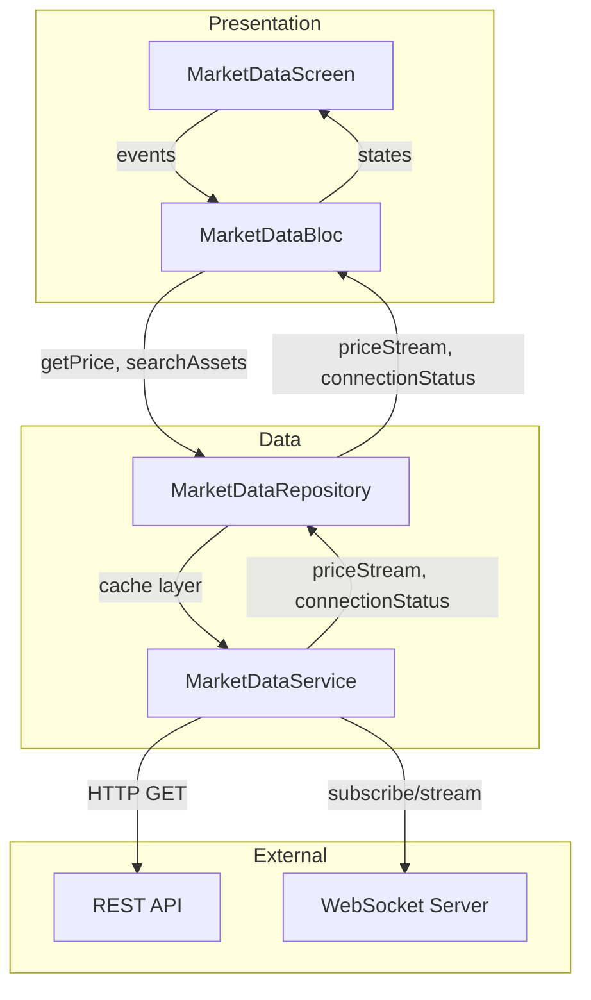
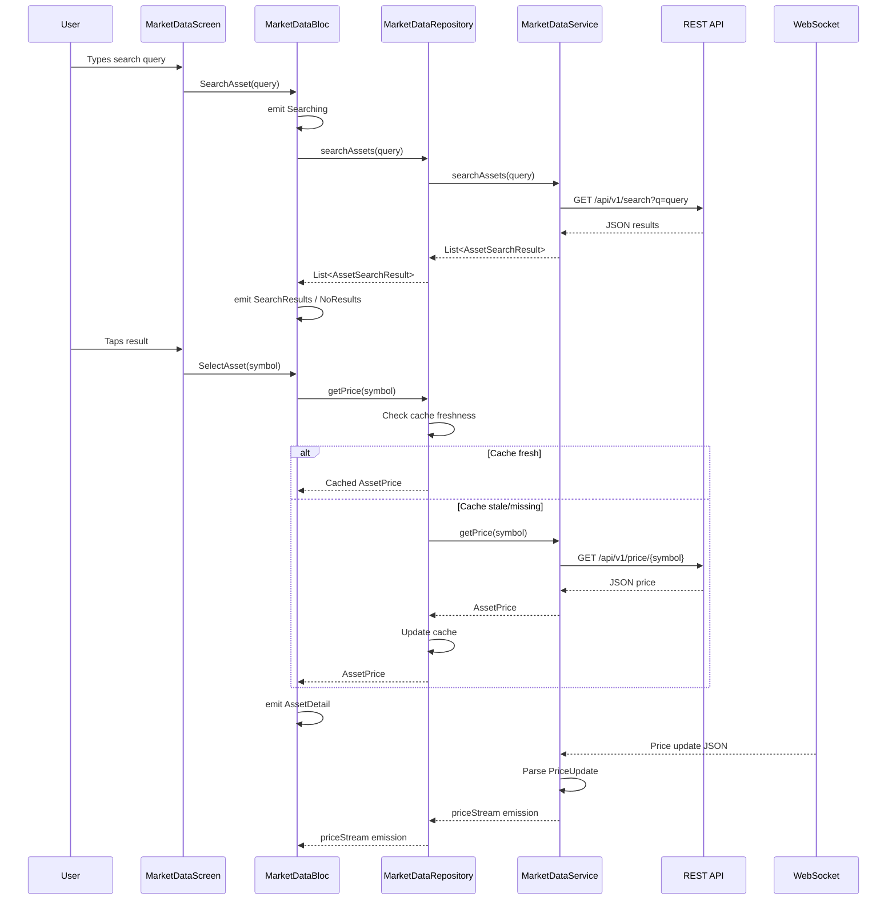

# Design Document: Market Data Display

## Overview

The Market Data Display feature provides Rally users with asset search, detailed price views, and real-time WebSocket price streaming. The architecture follows the existing layered pattern: domain models → data services → repositories → BLoC → UI. The feature integrates with a backend REST API for on-demand queries and a WebSocket endpoint for live price updates, with in-memory caching and exponential backoff reconnection for resilience.

### Key Design Decisions

1. **BLoC for state management** — Consistent with the existing app architecture using `flutter_bloc`. Events flow in, states flow out, making the search/detail/error flow predictable and testable.
2. **Repository pattern for caching** — The `MarketDataRepository` wraps `IMarketDataService` with an in-memory cache (60s staleness), providing fallback behavior on network failure without polluting the service layer.
3. **WebSocket with exponential backoff** — The service manages its own connection lifecycle, emitting `ConnectionStatus` changes that the BLoC and UI react to independently.
4. **kiri_check for property-based testing** — Already a dev dependency; used for verifying formatting, parsing, and caching invariants across generated inputs.

## Architecture



### Data Flow



## Components and Interfaces

### Domain Models

| Model | Fields | Purpose |
|-------|--------|---------|
| `AssetPrice` | symbol, price, dailyHigh, dailyLow, volume, percentageChange, timestamp | Full price data for a single asset |
| `AssetSearchResult` | symbol, name, currentPrice, percentageChange, type | Compact search result |
| `PriceUpdate` | symbol, price, dailyHigh, dailyLow, volume, percentageChange, timestamp | Real-time WebSocket update |
| `ConnectionStatus` | enum: connected, disconnected, reconnecting | WebSocket state |

### IMarketDataService (Interface)

```dart
abstract class IMarketDataService {
  Stream<PriceUpdate> get priceStream;
  Stream<ConnectionStatus> get connectionStatus;
  Future<AssetPrice> getPrice(String symbol);
  Future<List<AssetSearchResult>> searchAssets(String query);
  void subscribe(Set<String> symbols);
  void unsubscribe(Set<String> symbols);
}
```

### MarketDataService (Implementation)

- REST communication via `http.Client`
- WebSocket via `web_socket_channel`
- JSON parsing with type validation (throws `MarketDataException` on failure)
- Exponential backoff reconnection: delay = min(1000ms × 2^attempts, 30000ms)
- Silent discard of unparseable WebSocket messages

### MarketDataRepository

- Wraps `IMarketDataService` with in-memory `Map<String, AssetPrice>` cache
- Cache freshness: 60 seconds
- Fallback: returns cached price on fetch failure (if available)
- Forwards `priceStream` and `connectionStatus` from service

### MarketDataBloc

| Event | Resulting State(s) |
|-------|-------------------|
| `SearchAsset(query)` | `Searching` → `SearchResults` / `NoResults` / `MarketDataError` |
| `SelectAsset(symbol)` | `AssetDetail` / `MarketDataError` |
| `SubscribeSymbols(symbols)` | (triggers polling) |
| `ConnectionStatusChanged(status)` | `ConnectionWarning(lastUpdated)` |

### MarketDataScreen

- Search input with `onChanged` triggering `SearchAsset` for non-empty queries
- Search results list with symbol, name, price, percentage change
- Asset detail view with price, high/low, volume, directional icon, colored percentage
- Connection warning banner showing timestamp of last data
- Volume formatting: B (≥1B), M (≥1M), K (≥1K), plain decimal (<1K)

## Data Models

### AssetPrice JSON Schema

```json
{
  "symbol": "AAPL",
  "price": 185.50,
  "dailyHigh": 187.20,
  "dailyLow": 183.90,
  "volume": 52340000,
  "percentageChange": 1.25,
  "timestamp": "2024-01-15T14:30:00Z"
}
```

### AssetSearchResult JSON Schema

```json
{
  "symbol": "AAPL",
  "name": "Apple Inc.",
  "currentPrice": 185.50,
  "percentageChange": 1.25,
  "type": "stock"
}
```

### PriceUpdate JSON Schema (WebSocket)

```json
{
  "symbol": "AAPL",
  "price": 185.75,
  "dailyHigh": 187.20,
  "dailyLow": 183.90,
  "volume": 52500000,
  "percentageChange": 1.38,
  "timestamp": "2024-01-15T14:30:05Z"
}
```

### WebSocket Subscribe/Unsubscribe Messages

```json
{ "action": "subscribe", "symbols": ["AAPL", "TSLA"] }
{ "action": "unsubscribe", "symbols": ["TSLA"] }
```

## Correctness Properties

*A property is a characteristic or behavior that should hold true across all valid executions of a system — essentially, a formal statement about what the system should do. Properties serve as the bridge between human-readable specifications and machine-verifiable correctness guarantees.*

### Property 1: Volume formatting uses correct suffix based on magnitude

*For any* non-negative volume value, the formatted output SHALL end with "B" if volume ≥ 1,000,000,000; end with "M" if volume ∈ [1,000,000, 1,000,000,000); end with "K" if volume ∈ [1,000, 1,000,000); or be a plain decimal with 2 decimal places if volume < 1,000.

**Validates: Requirements 8.1, 8.2, 8.3, 8.4**

### Property 2: Percentage change display uses correct direction and color

*For any* percentage change value, the display SHALL show an up-arrow icon and green color when the value is non-negative, and a down-arrow icon and red color when the value is negative.

**Validates: Requirements 2.3, 2.4**

### Property 3: AssetPrice JSON round-trip

*For any* valid AssetPrice object, serializing to JSON then parsing back SHALL produce an equivalent AssetPrice object (all fields preserved).

**Validates: Requirements 9.1, 9.3**

### Property 4: AssetSearchResult JSON round-trip

*For any* valid AssetSearchResult object, serializing to JSON then parsing back SHALL produce an equivalent AssetSearchResult object (all fields preserved).

**Validates: Requirements 9.2**

### Property 5: Invalid JSON throws MarketDataException

*For any* JSON object that is missing a required field or has an incorrectly typed field, the parsing function SHALL throw a MarketDataException.

**Validates: Requirements 9.4, 7.4**

### Property 6: WebSocket price update parsing and emission

*For any* valid PriceUpdate JSON message received on the WebSocket, the service SHALL emit a PriceUpdate object on the price stream with all fields matching the original JSON values.

**Validates: Requirements 3.1, 3.2**

### Property 7: Invalid WebSocket messages are silently discarded

*For any* string that is not valid PriceUpdate JSON (malformed JSON, missing fields, wrong types), the service SHALL not emit any PriceUpdate and SHALL not throw an exception.

**Validates: Requirements 3.3**

### Property 8: Cache stores fetched prices and returns fresh ones without network call

*For any* symbol, after a successful price fetch, subsequent requests within 60 seconds SHALL return the cached price without making a network request to the service.

**Validates: Requirements 6.1, 6.2**

### Property 9: Cache fallback on network failure

*For any* symbol with a cached price, if the network fetch fails, the repository SHALL return the previously cached price rather than propagating the error.

**Validates: Requirements 6.3**

### Property 10: Exponential backoff calculation

*For any* reconnection attempt number n (where n ≥ 0), the reconnection delay SHALL equal min(1000 × 2^n, 30000) milliseconds.

**Validates: Requirements 4.2**

### Property 11: Non-200 HTTP status codes throw MarketDataException

*For any* HTTP response with a status code outside 200, the service SHALL throw a MarketDataException containing the status code in its message.

**Validates: Requirements 7.3**

## Error Handling

| Layer | Error Source | Handling Strategy |
|-------|-------------|-------------------|
| `MarketDataService` | HTTP non-200 response | Throw `MarketDataException` with status code |
| `MarketDataService` | Invalid JSON response body | Throw `MarketDataException` with parse error |
| `MarketDataService` | Invalid WebSocket message | Silently discard (no crash, no emission) |
| `MarketDataService` | WebSocket connection lost | Emit `disconnected` status, schedule reconnect |
| `MarketDataRepository` | Service throws + cache exists | Return cached price (fallback) |
| `MarketDataRepository` | Service throws + no cache | Propagate error to caller |
| `MarketDataRepository` | Timeout on fetch | Return cached price if available, else propagate |
| `MarketDataBloc` | Repository throws | Emit `MarketDataError(message)` state |
| `MarketDataScreen` | `MarketDataError` state | Display error UI with message |
| `MarketDataScreen` | `ConnectionWarning` state | Display warning banner with last-data timestamp |

### Reconnection Strategy

```
Attempt 0: delay = min(1000 × 2^0, 30000) = 1000ms  (1s)
Attempt 1: delay = min(1000 × 2^1, 30000) = 2000ms  (2s)
Attempt 2: delay = min(1000 × 2^2, 30000) = 4000ms  (4s)
Attempt 3: delay = min(1000 × 2^3, 30000) = 8000ms  (8s)
Attempt 4: delay = min(1000 × 2^4, 30000) = 16000ms (16s)
Attempt 5: delay = min(1000 × 2^5, 30000) = 30000ms (30s) ← cap reached
Attempt N (N≥5): delay = 30000ms
```

On successful reconnection: reset attempt counter to 0, re-subscribe all symbols, emit `connected` status.

## Testing Strategy

### Property-Based Tests (kiri_check)

The project already uses `kiri_check` (v1.3.1) for property-based testing. Each correctness property above maps to a single property-based test with a minimum of 100 iterations.

**Tag format:** `Feature: market-data-display, Property {N}: {title}`

| Property | Test File | What's Generated |
|----------|-----------|-----------------|
| 1 (Volume formatting) | `test/presentation/market_data_formatting_property_test.dart` | Random doubles across all magnitude ranges |
| 2 (Percentage direction/color) | `test/presentation/market_data_formatting_property_test.dart` | Random doubles in [-100, +1000] |
| 3 (AssetPrice round-trip) | `test/data/services/market_data_parsing_property_test.dart` | Random AssetPrice objects |
| 4 (AssetSearchResult round-trip) | `test/data/services/market_data_parsing_property_test.dart` | Random AssetSearchResult objects |
| 5 (Invalid JSON throws) | `test/data/services/market_data_parsing_property_test.dart` | Valid JSON with random field removed/corrupted |
| 6 (WebSocket emission) | `test/data/services/market_data_websocket_property_test.dart` | Random valid PriceUpdate JSON |
| 7 (Invalid WS messages) | `test/data/services/market_data_websocket_property_test.dart` | Random invalid strings and malformed JSON |
| 8 (Cache freshness) | `test/data/repositories/market_data_cache_property_test.dart` | Random symbols and AssetPrice objects |
| 9 (Cache fallback) | `test/data/repositories/market_data_cache_property_test.dart` | Random cached prices with simulated failures |
| 10 (Exponential backoff) | `test/data/services/market_data_reconnect_property_test.dart` | Random attempt counts 0..20 |
| 11 (HTTP error codes) | `test/data/services/market_data_parsing_property_test.dart` | Random status codes 400-599 |

### Unit Tests (flutter_test + bloc_test + mocktail)

Unit tests cover specific examples, BLoC event/state flows, and integration points:

- BLoC state transitions for SearchAsset, SelectAsset, ConnectionStatusChanged events
- Repository caching edge cases (exactly 60s boundary, concurrent requests)
- Widget rendering of search results and asset detail views
- Connection warning banner visibility based on state

### Integration Tests

- End-to-end search flow: type query → see results → tap → see detail
- WebSocket lifecycle: connect → receive updates → disconnect → reconnect → re-subscribe
