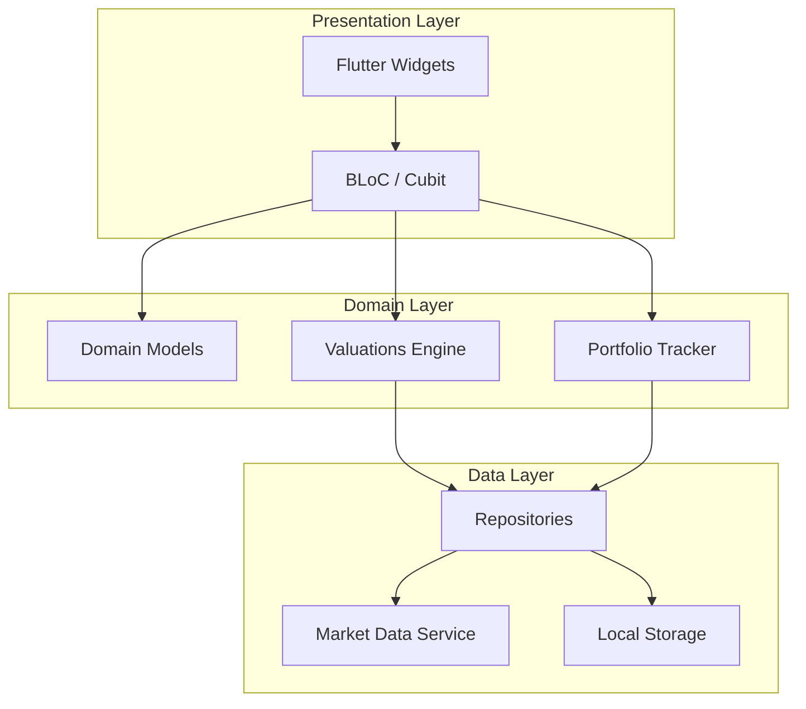
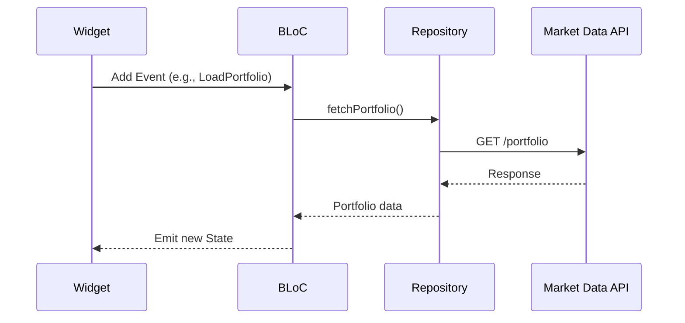

# Design Document: Stock Trading Valuations Engine

## Overview

This design describes a Flutter-based stock trading valuations engine that provides real-time market data, portfolio tracking, and trade recommendations powered by supply and demand zone analysis. The application uses a layered architecture with BLoC state management to separate business logic from UI, enabling testable domain logic and reactive data flows.

Key design decisions:
- **BLoC pattern** for state management — provides unidirectional data flow, stream-based reactivity ideal for real-time price updates, and strong testability via `bloc_test`
- **`fl_chart` package** for charting — supports both line charts and candlestick charts natively, is highly customizable for neon theming, and is actively maintained
- **Repository pattern** for data access — abstracts market data providers behind interfaces, enabling swappable API implementations and mock-based testing
- **WebSocket + REST hybrid** for market data — WebSocket for streaming price updates during market hours, REST fallback for historical data and initial loads

## Architecture



### Layer Responsibilities

| Layer | Responsibility |
|-------|---------------|
| Presentation | Widgets, BLoC event dispatch, state rendering, theming |
| Domain | Business logic, models, valuations algorithm, portfolio calculations |
| Data | API communication, local persistence, data transformation |

### State Management Flow



## Components and Interfaces

### 1. Market Data Service

Responsible for fetching and streaming real-time market data.

```dart
abstract class IMarketDataService {
  /// Stream of real-time price updates for subscribed assets
  Stream<PriceUpdate> get priceStream;

  /// Fetch current price for a single asset
  Future<AssetPrice> getPrice(String symbol);

  /// Search assets by query string
  Future<List<AssetSearchResult>> searchAssets(String query);

  /// Fetch OHLC data for charting
  Future<List<OhlcCandle>> getOhlcData({
    required String symbol,
    required TimeDuration duration,
    DateTime? startDate,
    DateTime? endDate,
  });

  /// Subscribe to real-time updates for a set of symbols
  void subscribe(Set<String> symbols);

  /// Unsubscribe from updates
  void unsubscribe(Set<String> symbols);

  /// Connection status stream
  Stream<ConnectionStatus> get connectionStatus;
}
```

### 2. Portfolio Tracker

Manages user portfolio holdings and calculations.

```dart
abstract class IPortfolioTracker {
  /// Add or update a holding in the portfolio
  Result<Holding> addHolding({
    required String symbol,
    required double quantity,
    required double averagePurchasePrice,
  });

  /// Get all current holdings
  List<Holding> getHoldings();

  /// Recalculate portfolio values with updated prices
  PortfolioSummary recalculate(Map<String, double> currentPrices);

  /// Remove a holding from the portfolio
  Result<void> removeHolding(String symbol);
}
```

### 3. Valuations Engine

Analyzes supply/demand zones and generates trade predictions.

```dart
abstract class IValuationsEngine {
  /// Identify supply zones from historical price data
  List<PriceZone> identifySupplyZones(List<OhlcCandle> historicalData);

  /// Identify demand zones from historical price data
  List<PriceZone> identifyDemandZones(List<OhlcCandle> historicalData);

  /// Generate trade recommendations based on current price and zones
  List<Recommendation> generateRecommendations({
    required String symbol,
    required double currentPrice,
    required List<PriceZone> supplyZones,
    required List<PriceZone> demandZones,
  });

  /// Calculate reward/risk ratio for a trade setup
  RewardRiskRatio calculateRewardRisk({
    required TradeDirection direction,
    required double entryPrice,
    required double targetPrice,
    required double stopLossPrice,
  });

  /// Categorize a recommendation by trade duration
  TradeCategory categorize({
    required double entryPrice,
    required double targetPrice,
    required TimeDuration timeframe,
  });

  /// Check if a recommendation should be completed (target or stop hit)
  bool isCompleted(Recommendation recommendation, double currentPrice);
}
```

### 4. Chart View Controller

Manages chart state and data loading.

```dart
abstract class IChartController {
  /// Load chart data for an asset and time duration
  Future<ChartData> loadChartData({
    required String symbol,
    required TimeDuration duration,
  });

  /// Toggle between line and candlestick chart types
  ChartType toggleChartType();

  /// Get current chart type
  ChartType get currentChartType;
}
```

### 5. Theme Manager

Handles light/dark mode switching and persistence.

```dart
abstract class IThemeManager {
  /// Get the current theme mode
  ThemeMode get currentTheme;

  /// Toggle between light and dark themes
  Future<void> toggleTheme();

  /// Load persisted theme preference
  Future<ThemeMode> loadPersistedTheme();

  /// Persist theme preference
  Future<void> persistTheme(ThemeMode mode);
}
```

## Data Models

```dart
/// Represents a single OHLC candle
class OhlcCandle {
  final DateTime timestamp;
  final double open;
  final double high;
  final double low;
  final double close;
  final double volume;
}

/// A supply or demand zone identified by the valuations engine
class PriceZone {
  final double upperBound;
  final double lowerBound;
  final ZoneType type; // supply or demand
  final int touchCount; // number of price rejections/bounces
  final DateTime firstIdentified;
}

/// A trade recommendation
class Recommendation {
  final String symbol;
  final String assetName;
  final TradeDirection direction; // buy or short
  final TradeCategory category; // day, swing, position
  final double entryPrice;
  final double targetPrice;
  final double stopLossPrice;
  final RewardRiskRatio rewardRisk;
  final DateTime generatedAt;
  final RecommendationStatus status; // active, completed
}

/// Reward/risk ratio value object
class RewardRiskRatio {
  final double value;

  /// For buy: (target - entry) / (entry - stopLoss)
  /// For short: (entry - target) / (stopLoss - entry)
  factory RewardRiskRatio.calculate({
    required TradeDirection direction,
    required double entryPrice,
    required double targetPrice,
    required double stopLossPrice,
  });
}

/// Portfolio holding
class Holding {
  final String symbol;
  final double quantity; // 0.0001 to 999,999,999, up to 4 decimal places
  final double averagePurchasePrice; // 0.01 to 999,999,999.99, 2 decimal places
  final double? currentPrice;
  final DateTime? lastPriceUpdate;
}

/// Portfolio summary with calculated values
class PortfolioSummary {
  final List<HoldingValuation> holdings;
  final double totalValue;
  final double totalGainLoss;
}

/// Individual holding valuation
class HoldingValuation {
  final Holding holding;
  final double totalValue; // currentPrice * quantity
  final double unrealizedGainLoss; // (currentPrice - avgPrice) * quantity
}

/// Real-time price update from WebSocket
class PriceUpdate {
  final String symbol;
  final double price;
  final double dailyHigh;
  final double dailyLow;
  final double volume;
  final double percentageChange;
  final DateTime timestamp;
}

/// Asset search result
class AssetSearchResult {
  final String symbol;
  final String name;
  final double currentPrice;
  final double percentageChange;
  final AssetType type; // stock, etf, crypto
}

/// Time duration options for charts
enum TimeDuration {
  oneMin, fiveMin, fifteenMin, thirtyMin,
  oneHour, fourHour, eightHour, twelveHour, twentyFourHour,
  oneWeek, oneMonth, oneQuarter, oneYear, allTime,
}

/// Trade direction
enum TradeDirection { buy, short }

/// Trade category by duration
enum TradeCategory { dayTrade, swingTrade, positionTrade }

/// Chart display type
enum ChartType { line, candlestick }

/// Zone type
enum ZoneType { supply, demand }

/// Connection status
enum ConnectionStatus { connected, disconnected, reconnecting }

/// Theme mode
enum ThemeMode { light, dark }
```


## Correctness Properties

*A property is a characteristic or behavior that should hold true across all valid executions of a system — essentially, a formal statement about what the system should do. Properties serve as the bridge between human-readable specifications and machine-verifiable correctness guarantees.*

### Property 1: Valid holding storage round-trip

*For any* valid asset symbol, quantity in [0.0001, 999999999] with up to 4 decimal places, and average purchase price in [0.01, 999999999.99] with up to 2 decimal places, adding the holding and then retrieving it SHALL return the same symbol, quantity, and average purchase price.

**Validates: Requirements 1.1**

### Property 2: Invalid input rejection

*For any* input where the quantity is outside [0.0001, 999999999], has more than 4 decimal places, or is non-positive, OR the purchase price is outside [0.01, 999999999.99], has more than 2 decimal places, or is non-positive, OR the symbol is empty, the Portfolio_Tracker SHALL reject the entry and return an error identifying the invalid field(s).

**Validates: Requirements 1.2**

### Property 3: Weighted average calculation

*For any* existing holding with quantity Q1 and average price P1, and a new addition with quantity Q2 and price P2, the resulting average price SHALL equal (Q1 * P1 + Q2 * P2) / (Q1 + Q2) and the resulting total quantity SHALL equal Q1 + Q2.

**Validates: Requirements 1.3**

### Property 4: Portfolio valuation arithmetic

*For any* holding with quantity Q, average purchase price P_avg, and current market price P_current, the total value SHALL equal P_current * Q and the unrealized gain/loss SHALL equal (P_current - P_avg) * Q, both rounded to 2 decimal places.

**Validates: Requirements 1.4**

### Property 5: Numeric display formatting

*For any* numeric price, percentage, or ratio value displayed to the user, the formatted output SHALL contain exactly 2 decimal places.

**Validates: Requirements 2.4, 4.5**

### Property 6: Trade category assignment

*For any* prediction with a target hold duration, the Valuations_Engine SHALL assign exactly one TradeCategory: day trade if duration < 24 hours, swing trade if duration is between 1 day and 2 weeks inclusive, or position trade if duration > 2 weeks.

**Validates: Requirements 3.2**

### Property 7: Reward/Risk ratio formula

*For any* valid price triple (entry, target, stopLoss) where entry ≠ stopLoss, the Reward_Risk_Ratio SHALL equal (target - entry) / (entry - stopLoss) for buy direction and (entry - target) / (stopLoss - entry) for short direction.

**Validates: Requirements 3.3**

### Property 8: Recommendations sorted by R:R descending

*For any* list of active recommendations, the displayed order SHALL have each recommendation's Reward_Risk_Ratio greater than or equal to the next recommendation's Reward_Risk_Ratio.

**Validates: Requirements 3.4**

### Property 9: Zone detection requires minimum touch count

*For any* historical OHLC dataset, a price zone SHALL be identified as a supply zone only if at least 2 prior price rejections occurred from that zone, and as a demand zone only if at least 2 prior price bounces occurred from that zone.

**Validates: Requirements 3.5, 3.6**

### Property 10: Recommendation generation near zone boundaries

*For any* current price within 1% of a demand zone boundary, a buy recommendation SHALL be generated if and only if the calculated R:R exceeds 1.00. Symmetrically, for any current price within 1% of a supply zone boundary, a short recommendation SHALL be generated if and only if the calculated R:R exceeds 1.00.

**Validates: Requirements 3.7, 3.8**

### Property 11: Recommendation completion detection

*For any* active recommendation, if the current price reaches or exceeds the target price (for buys) or falls to or below the target price (for shorts), OR reaches or exceeds the stop loss price (for shorts) or falls to or below the stop loss price (for buys), the recommendation SHALL be marked as completed.

**Validates: Requirements 3.9**

### Property 12: R:R display format

*For any* Reward_Risk_Ratio value V, the formatted display string SHALL match the pattern "R:R X.XX" where X.XX is V rounded to 2 decimal places.

**Validates: Requirements 4.3**

### Property 13: Incomplete recommendation filtering

*For any* recommendation with a missing entry price, stop loss price, or target price, the recommendation SHALL NOT be included in the displayed recommendations list.

**Validates: Requirements 4.7**

### Property 14: Candlestick geometry correctness

*For any* OHLC candle with values (open, high, low, close), the rendered candle body top SHALL equal max(open, close), body bottom SHALL equal min(open, close), wick top SHALL equal high, and wick bottom SHALL equal low. Bullish candles (close > open) and bearish candles (close < open) SHALL be assigned two distinct colors.

**Validates: Requirements 5.5, 5.6**

### Property 15: Chart type independence from time duration

*For any* chart type selection (line or candlestick) and any time duration change, the chart type SHALL remain unchanged after the duration is updated.

**Validates: Requirements 6.5**

### Property 16: Theme persistence round-trip

*For any* theme mode (light or dark), persisting the preference and then loading it SHALL return the same theme mode.

**Validates: Requirements 7.4**

### Property 17: Color contrast accessibility

*For any* text-background color pair in both light and dark themes, the WCAG contrast ratio SHALL be at least 4.5:1. For any non-text UI component (buttons, icons, chart elements) and its adjacent color, the contrast ratio SHALL be at least 3:1. These ratios SHALL hold with neon glow effects active.

**Validates: Requirements 8.4, 8.5**

### Property 18: Directional color assignment

*For any* buy recommendation or positive percentage change, the assigned color SHALL be in the green neon spectrum. For any short recommendation or negative percentage change, the assigned color SHALL be in the red neon spectrum. The two colors SHALL be distinct.

**Validates: Requirements 8.2, 8.3**

## Error Handling

### Market Data Failures

| Scenario | Behavior |
|----------|----------|
| API timeout (> 3s for chart, > 60s for portfolio) | Display stale indicator with last-known data and elapsed time |
| WebSocket disconnection | Show connection warning banner, retain last prices, attempt reconnection with exponential backoff |
| Search returns no results | Display "no results found" message |
| Invalid API response format | Log error, fall back to cached data if available |

### Portfolio Validation Errors

| Scenario | Behavior |
|----------|----------|
| Invalid quantity (outside range, too many decimals) | Reject with specific field error message |
| Invalid price (outside range, too many decimals) | Reject with specific field error message |
| Invalid/empty symbol | Reject with specific field error message |
| Multiple invalid fields | Report all invalid fields in single error |

### Valuations Engine Errors

| Scenario | Behavior |
|----------|----------|
| Insufficient historical data for zone detection | Return empty zone list, no recommendations generated |
| R:R calculation with zero denominator (entry = stop) | Reject as invalid setup, do not generate recommendation |
| Incomplete recommendation data | Filter from display, log data integrity warning |
| Division by zero in R:R | Return error result, skip recommendation |

### Chart Errors

| Scenario | Behavior |
|----------|----------|
| Fewer than 2 data points | Show "insufficient data" message instead of chart |
| Network error during data load | Show error message, retain previous chart data |
| Invalid OHLC data (high < low, etc.) | Skip invalid candles, render remaining valid data |

### Theme Errors

| Scenario | Behavior |
|----------|----------|
| Corrupted persisted theme preference | Default to dark theme |
| Local storage write failure | Apply theme in memory, retry persistence |

## Testing Strategy

### Unit Tests

Unit tests cover specific examples, edge cases, and integration points:

- Portfolio operations: add holding, duplicate symbol merge, empty portfolio state
- Input validation: boundary values (0.0001, 999999999, etc.), invalid inputs
- R:R calculation: specific known-good examples, zero denominator edge case
- Zone detection: known supply/demand patterns in synthetic data
- Chart type toggle: line → candlestick → line transitions
- Theme toggle and persistence: light/dark switching, corrupted storage
- Formatting: specific values formatted to 2 decimal places
- Recommendation display: all field presence, incomplete data filtering

### Property-Based Tests

Property-based tests validate universal properties across randomly generated inputs.

**Library:** `dart_check` (Dart property-based testing library compatible with Flutter test framework)

**Configuration:**
- Minimum 100 iterations per property test
- Each test tagged with feature and property reference

**Tag format:** `Feature: stock-trading-valuations-engine, Property {number}: {property_text}`

Properties to implement:
1. Valid holding storage round-trip (Property 1)
2. Invalid input rejection (Property 2)
3. Weighted average calculation (Property 3)
4. Portfolio valuation arithmetic (Property 4)
5. Numeric display formatting (Property 5)
6. Trade category assignment (Property 6)
7. Reward/Risk ratio formula (Property 7)
8. Recommendations sorted by R:R descending (Property 8)
9. Zone detection minimum touch count (Property 9)
10. Recommendation generation near zones (Property 10)
11. Recommendation completion detection (Property 11)
12. R:R display format (Property 12)
13. Incomplete recommendation filtering (Property 13)
14. Candlestick geometry correctness (Property 14)
15. Chart type independence from time duration (Property 15)
16. Theme persistence round-trip (Property 16)
17. Color contrast accessibility (Property 17)
18. Directional color assignment (Property 18)

### Integration Tests

- Market Data Service connectivity and price streaming via WebSocket
- Local storage persistence (SharedPreferences / Hive)
- End-to-end: price update → portfolio recalculation → UI update
- Chart data loading across different time durations
- Search functionality with real/mocked API responses

### Widget Tests

- Portfolio view renders all holding fields correctly
- Recommendation cards display all required information
- Chart toggle switches between line and candlestick views
- Theme toggle applies correct colors across screens
- Empty states display appropriate messages
- Loading indicators appear during data fetches
- Stale data indicators show with correct elapsed time
