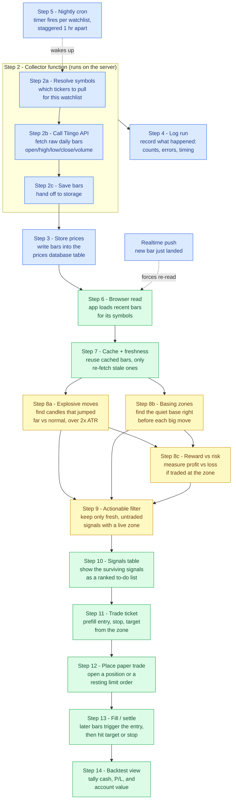

# Signals Workflow

How a raw price bar becomes an actionable trade signal, end to end. Each box is a
step with a short title. Details for each step are listed below the diagram.

## Full flow diagram

Each box has a short title plus a one-line "what happens here" so you can follow
the flow without reading the details section.

Legend: blue = server / data collection, green = browser / UI, yellow = signal logic.

### A few terms the diagram uses

- **ATR (Average True Range)** — the stock's normal daily price swing. Measuring
  moves in ATR means a 5% day counts as huge for a calm stock but ordinary for a
  wild one, so every symbol is judged on the same scale.
- **Zone (proximal / distal)** — the price band of the quiet base. `proximal` is
  the near edge (where you'd enter), `distal` is the far edge (where you'd place
  the stop just beyond).
- **Mitigated zone** — a zone price has already returned to. The fresh first-touch
  entry is "used up," so it's dropped from actionable signals.
- **Fresh** — the move happened recently (within a set number of calendar days),
  so it's still worth acting on.

## Steps

**2. Collector function** — A small server-side program (a Supabase Edge Function)
that does the actual Tiingo work, because the browser can't. It's the only thing
that ever connects to Tiingo. It runs three internal sub-steps in order:

- **2a. Resolve symbols** — figure out which tickers to pull (one watchlist, or
  the whole active universe).
- **2b. Call Tiingo API** — connect to Tiingo and fetch each symbol's raw
  adjusted daily bars (open/high/low/close/volume), a few at a time to stay under
  rate limits. This is the single Tiingo connection. `fetchTiingoBars`
- **2c. Save bars** — hand the fetched bars off to storage (Step 3).

It has three modes: `primary` (a list's full nightly pull), `catchup` (smart —
skips any symbol that already has today's bar, so a normal morning does almost
nothing), and `manual` (a button-triggered refresh). `collect-daily-bars/index.ts`
→ `Deno.serve`

> **Guard: no full-universe sweep.** Step 2a will only resolve symbols when it's
> given a `watchlistId` (one list, ≤40 symbols) or an explicit `symbols[]` list.
> An unscoped run (no watchlist, no symbols) is **hard-refused** and logged as a
> failed run. This is deliberate: pulling all ~400 symbols at once would blow
> past Tiingo's free-tier rate limit (~50 requests/hour) and burn the monthly
> unique-symbol budget on a run that's guaranteed to mostly fail. Legitimate
> collection is always per-watchlist via the nightly cron.

**3. Store prices** — Bars are written into the `prices` table. Each row is keyed
by `symbol + date`, so re-running a collection just overwrites the same rows
instead of creating duplicates (this is what "upsert" means: insert-or-update).

**4. Log run** — One `pipeline_runs` row per run with per-stage status, counts,
and delisted-symbol detection. Viewed on the Data Pipeline page.
`logRun`

**5. Nightly cron** — Per-watchlist pg_cron jobs on trading days. Each list gets
a *primary* overnight pull (staggered one hour apart so no two lists share an
hour) plus a *smart catch-up* that re-pulls only symbols missing the latest
completed session's bar. The catch-up ladder is also staggered one hour apart and
timed to finish before the US market close, so it never chases a bar Tiingo
hasn't published yet. Auto-reschedules when watchlists change.
`migrations/0009_per_watchlist_cron.sql` (catch-up times later shifted by
`migrations/0014_catchup_before_close.sql`)

> **Hard rate-limit guarantee.** Scheduling alone can't guarantee we stay under
> Tiingo's free-tier cap (~50 requests/rolling hour) — a partially-failed primary
> or an overlapping run could stack requests. So the collector enforces a hard
> budget at the moment of each request. It counts how many Tiingo requests it has
> made in the last 60 minutes (recorded in `tiingo_request_log`, see
> `migrations/0017_tiingo_request_log.sql`), fetches at most the remaining budget,
> and **defers** any leftover symbols to the next scheduled run. Deferral is a
> healthy outcome (logged as a message, not a failure). The budget is **45/hour**,
> with **40 reserved for `primary` runs** — a `catchup`/`manual` run may only use
> the leftover (45 − 40 = 5), so a catch-up can never spend budget a primary
> needs. Primaries always win. On any counting error the collector fails closed
> (assumes no budget left) so the cap can never be exceeded.

**6. Browser read** — App reads the latest bars for its symbols from Supabase
(the ~260 most recent daily bars per symbol). `supabaseDailyStore.ts` →
`fetchDailyBarsFromSupabase`

> **Shared read, not signals-only.** This is a single, shared data load. The bars
> it fetches feed *everything* in the app — the homepage prices / ticker tape /
> movers *and* the Signals page *and* the Backtest fill logic — all from one set
> of stocks. Signals and the homepage aren't separate fetches; they're different
> views of the same loaded bars, so a re-read updates both at once. It's shown in
> this diagram because signals can't be computed without it: it's the bridge from
> "bars are in the database" (Steps 1–5) to "compute signals" (Steps 8+).
>
> It runs only while the app is open, and fires on: initial load, watchlist
> change, a realtime push when the collector writes a new bar, the post-close
> trading-day rollover, or a manual refresh.

**7. Cache + freshness** — To avoid re-downloading everything on every visit, the
app keeps a local cache of bars. On load it shows the cached bars instantly, then
checks which symbols are *stale* (missing the latest trading day's bar) and only
re-reads those from the database. When the collector writes a brand-new bar, a
realtime push tells the app to re-read that symbol immediately, so signals update
without waiting for a reload. `useWatchlistMarket.ts`, `dailyCache.ts`

> **Budget gauge (real, not local).** The dashboard shows a
> "{tracked}/500 symbols tracked" gauge for Tiingo's free-tier monthly
> unique-symbol budget. It reflects *real* usage: a live count of active tracked
> symbols across all watchlists (`fetchActiveSymbolCount`) — which is exactly
> what the server-side collector pulls each month — measured against the 500 cap
> (`TIINGO_MONTHLY_SYMBOL_CAP`). This replaced an older browser-local "symbols
> cached this month" meter that measured on-device trivia and implied a limit it
> didn't actually track.

**8a. Explosive moves** — Scans every candle for an ATR-relative move (≥ 2× ATR)
with a strong body (≥ 0.6). Volume surge lifts the grade to A+.
`useExplosiveMoves.ts`

**8b. Basing zones** — An explosive move on its own isn't tradeable — you need a
level to trade *against*. This step starts at each explosive candle and walks
backward to find the tight, quiet consolidation (the "base") that came right
before it. From that base it derives the zone edges (proximal = entry, distal =
stop), a profit target (the top of the move the breakout produced), a quality
grade, and whether price has already come back to the zone (mitigated = used up).
`useBasingZones.ts`

**8c. Reward:risk** — Computes R:R a zone would produce at the proximal entry.
Single source of truth shared by Signals, the ticket, and Backtest.
`tradeMath.ts` → `signalRewardRisk`

**9. Actionable filter** — This is where the two branches join. A move only
survives if it is *fresh*, *has a zone that isn't mitigated* (a first-touch entry
still available), and *hasn't already been traded*. What's left then passes
through your saved display filters (minimum grade, direction, ATR, volume, R:R).
`ExplosiveMoves.tsx`, `useSignalFilters.ts`

**10. Signals table** — Renders each actionable signal (grade, move size, ATR×,
rel volume, R:R). Row click opens the detail modal. `ExplosiveMoves.tsx`

**11. Trade ticket** — Re-detects the zone to seed the ticket: proximal→limit,
distal→stop, swing→target, kind→side, plus signal provenance. `App.tsx`

**12. Place paper trade** — Opens a market position or resting limit order and
persists it. `useBacktestPortfolio.ts` → `openTrade`

**13. Fill / settle** — As new daily bars arrive, the app checks each order
against them. A resting limit order *fills* when a later day's price trades
through the entry level. An open position *settles* when a later day trades
through its target (profit) or stop (loss), and the realized gain/loss is banked.
Both only look at bars *after* the order was placed, so nothing round-trips
instantly. `fillPending`, `settleOpen`

**14. Backtest view** — Portfolio summary rolls positions + live prices into
cash, P/L, and account value. `Backtest.tsx`, `computePortfolioSummary`

## Branch notes

- **8a and 8b run in parallel** over the same cached bars, then join per symbol at
  step 9: a move is only actionable when it also has a fresh, unmitigated zone.
- **Realtime push** is a shortcut around the cron→cache delay: a new price write
  goes straight to the browser and re-triggers the signal scan.
- **Backtest** is a downstream branch off a placed trade, not part of ingestion.
  It reuses the same cached bars to simulate fills and exits.
